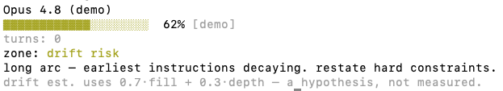

# context-check

[](https://github.com/wallacedrew/context-check/actions/workflows/test.yml)

A statusline gauge for [Claude Code](https://code.claude.com/) that gives you a
glanceable read on context load: how full the window is, and how long the
conversation arc has grown. Zero dependencies, Node 18+.



That's the full multi-line view from `context-check --demo`. In your
statusline (`--line` mode) you see just the top row — `Opus 4.8 ▓▓▓▓▓▓▓░░░ 62% drift risk` — colored green / amber / red as the bar slides through zones.

---

## The story

**The base case is the statusline.** You wire `context-check --line` into your
Claude Code settings *once*. From then on a single colored row sits at the
bottom of your prompt and updates every turn. You don't run anything — you
just glance down. The whole value is the moment you notice the bar slide into
amber (`drift risk`) or red (`dilution` / `compaction wall`), which is your
cue to restate a hard constraint or run `/compact`.

When you want the reasoning, not just the signal, run `context-check`
directly. The multi-line gauge adds the per-zone advice line, the auto-compact
note, and the hypothesis disclaimer.

Both modes drive one decision: **keep going, restate a constraint, or compact
now.**

---

## Why not just `/context`?

Claude Code already ships two adjacent features. `/context` prints the
current token breakdown on demand, and **auto-compact** kicks in at
`auto_compact_threshold_percent` (default 80%) to truncate before the window
overruns.

What Claude doesn't ship: a passive, always-on visual gauge with zones and
drift measurement. `/context` is poll-the-data, auto-compact is the
last-second safety net — neither tells you mid-conversation that you're
sliding from `sharp` into `drift risk`. That's the gap context-check fills.

---

## Install

```bash
npm install -g github:wallacedrew/context-check
context-check install
```

Two lines. The first puts `context-check` on your `PATH` (requires Node 18+).
The second writes the statusline block into `~/.claude/settings.json` (saving a
`.bak` of whatever was there). Reload Claude Code and the gauge appears.

> **Using `nodenv` (or another shim-based version manager)?** Run
> `nodenv rehash` after the `npm install` so the shim picks up the new
> binary — otherwise `context-check install` will be "command not found".

### Also show the project folder name

Add `--with-dir` to install, and the row gets prefixed with the current
project folder:

```bash
context-check install --with-dir
```

You'll see `my-project | Opus 4.8 ▓▓▓▓░░░░░░ 42% sharp` instead of just
the model + gauge. Re-run `context-check install` (without the flag) to
switch back; no `--force` needed either way.

### Other install knobs

Pin a specific version with `#v1.1.0` (or any tag/branch/SHA) on the install
URL:

```bash
npm install -g github:wallacedrew/context-check#v1.1.0
```

If `context-check install` finds a *different* `statusLine` already
configured (something that isn't ours), it refuses and points you at
`--force`. If you'd rather configure by hand, drop this block into
`~/.claude/settings.json` yourself:

```json
{
  "statusLine": {
    "type": "command",
    "command": "context-check --line"
  }
}
```

## Uninstall

```bash
context-check uninstall
npm uninstall -g context-check
```

The first command removes the `statusLine` block from `~/.claude/settings.json`
(saving the original to `.bak` first). It recognizes both variants of our
command (with or without `--with-dir`) and removes either without `--force`.
The second removes the binary. Run the subcommand *before* the npm uninstall —
once the binary's gone, the subcommand goes with it.

## On-demand check

```bash
# See sample output without piping anything
context-check --demo

# Or pipe a session JSON object (this is what Claude Code does for you)
echo '{"model":{"display_name":"Opus 4.8"},"context_window":{"used_percentage":62}}' \
  | context-check
```

---

## Zones

The bar's color tells you which of six zones you're in:

| Zone | Color | What to do |
|---|---|---|
| `crisp` | green | nothing — full headroom |
| `sharp` | green | nothing — recent context dominant |
| `drift risk` | amber | restate hard constraints |
| `dilution` | red | consider `/compact` soon |
| `compaction wall` | red | `/compact` now |
| `blind` | dim | no usage data yet — wait for next API call |

A row showing `⚠` means you've crossed Claude Code's auto-compact threshold
(80% by default); auto-compact will kick in soon.

## Hard guarantees

- **Never crashes in statusline mode.** All failure paths degrade to a single
  readable line and exit 0.
- **Never hangs.** stdin read times out at 200ms.
- **Respects `NO_COLOR`.** Set the env var to disable ANSI escape codes.

---

## FAQ

**Does it phone home?**
No. Pure stdin processing — read JSON, render to stdout, exit. No network
calls anywhere in the source. The tarball is `src/*.js` (~10 files, ~10 kB
total) plus README and LICENSE; the whole tool is readable in a few minutes.

**Does `/resume` work?**
Yes. Turn depth is counted by tailing `transcript_path` from the session
JSON, so resuming an old session just hands the gauge a longer transcript
to count from.

**Does it work on Bedrock (or any provider without `used_percentage`)?**
Partially. When `context_window.used_percentage` isn't populated the gauge
falls through to `current_usage.*_input_tokens`. If neither is available
the row shows `--% blind`. This is expected behavior, not a crash —
the data simply isn't populated yet.

**Something else?**
File an issue at <https://github.com/wallacedrew/context-check/issues>.

---

## Internals

Source layout, data contract, edge cases, roadmap, and how to run the
tests / cut a release live in [DEVELOPMENT.md](DEVELOPMENT.md).
